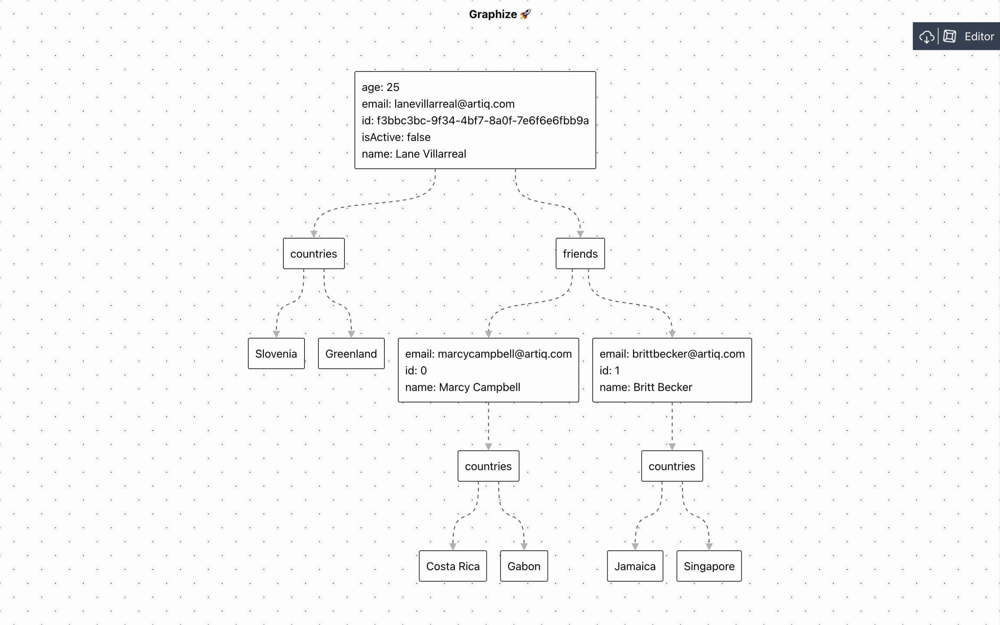

# Graphize 🚀

Visualize and download JSON / YAML content in your browser

## Demo

## Key Features

- Preview your JSON / YAML documents instantly
- Pinch / Scroll Zoom into the rendered image
- Formatting for content editor
- Download as PNG for reuse
- Sharable URL
- Copy node and specific child tree

### Roadmap

- XML Support
- Download SVG for Reuse

## Credits

This software uses the following open source packages:

- [React](https://github.com/facebook/react)
- [Monaco Editor](https://microsoft.github.io/monaco-editor/)
- [Reaflow](https://github.com/reaviz/reaflow)
- [html-to-image](https://github.com/bubkoo/html-to-image)
- [Download JS](https://github.com/rndme/download)
- [YamlJS](https://github.com/jeremyfa/yaml.js)
- [react-zoom-pan-pinch](https://github.com/prc5/react-zoom-pan-pinch)
- [Parcel](https://github.com/parcel-bundler/parcel)

## Support

## Contributing

Feel free to dive in! [Open an issue](https://github.com/apvarun/graphize/issues/new) or submit PRs.

## License

[MIT](LICENSE) © Varun A P
